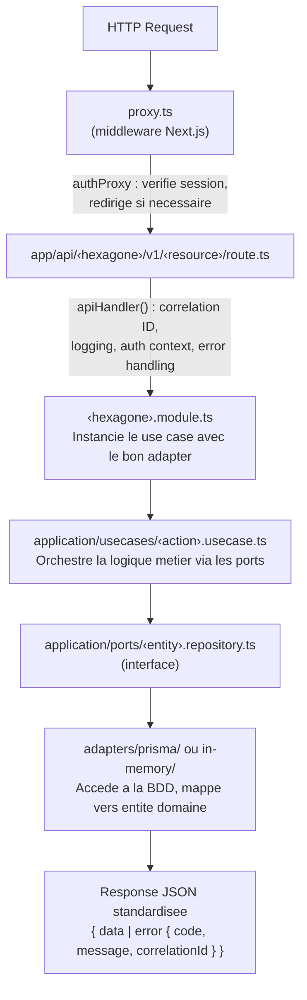
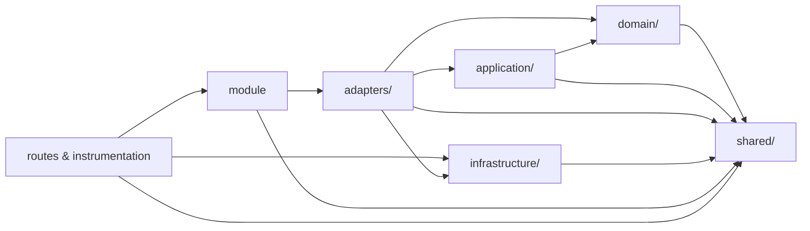

# Platform Starter Next.js

| CI/CD | Stack | Qualite | Tooling |
|---|---|---|---|
| [](https://github.com/NerionSoft/platform-starter-nextjs/actions/workflows/ci.yml) [](https://github.com/NerionSoft/platform-starter-nextjs/actions/workflows/release.yml) |          |      |   |

---

Template de demarrage Next.js de NerionSoft, avec architecture hexagonale, authentification, CI/CD centralisee et qualite de code integree.

## Table des matieres

- [Demarrage rapide](#demarrage-rapide)
- [Script de setup](#script-de-setup)
- [Architecture](#architecture)
- [Conventions](#conventions)
- [CI/CD](#cicd)
- [Les a priori du starter](#les-a-priori-du-starter)
- [Documentation](#documentation)

---

## Demarrage rapide

```bash
# 1. Cloner le repo
git clone https://github.com/NerionSoft/platform-starter-nextjs.git
cd platform-starter-nextjs

# 2. Installer les dependances (lance aussi prisma generate via postinstall)
pnpm install

# 3. Configurer l'environnement
cp .env.example .env
# Editer .env avec vos valeurs

# 4. Lancer en dev
pnpm dev
```

### Variables d'environnement

| Variable | Requis | Description |
|---|---|---|
| `DATABASE_URL` | Oui | Connection string PostgreSQL |
| `BETTER_AUTH_SECRET` | Oui | Secret pour better-auth (`openssl rand -base64 32`) |
| `NEXT_PUBLIC_APP_URL` | Non | URL publique de l'app (callbacks auth, cookies) |
| `LOG_LEVEL` | Non | Niveau de log Pino (`debug`, `info`, `warn`, `error`) |

### Scripts disponibles

| Commande | Description |
|---|---|
| `pnpm dev` | Serveur de developpement |
| `pnpm build` | Build de production |
| `pnpm start` | Demarrage en production |
| `pnpm lint` | Linting ESLint |
| `pnpm format` | Formatage Prettier |
| `pnpm format:check` | Verification du formatage |
| `pnpm test` | Tests unitaires (Vitest) |
| `pnpm test:watch` | Tests en mode watch |
| `pnpm test:coverage` | Tests avec couverture (V8 + LCOV) |
| `pnpm test:e2e` | Tests end-to-end (Playwright) |
| `pnpm auth:generate` | Generer le schema Prisma depuis la config auth |

---

## Script de setup

A la creation d'un nouveau projet, le script interactif renomme l'hexagone d'exemple vers votre domaine metier :

```bash
node scripts/setup.mjs
```

Il demande :
1. **Nom du projet** (pour `package.json`)
2. **Description du projet**
3. **Nom du premier domaine** (ex: `billing`)
4. **Nom de la premiere entite** (ex: `invoice`)

Le script effectue ensuite automatiquement :
- Renommage de `example-hexagone/` vers `<domaine>/`
- Remplacement de `Example`/`example` par votre entite (PascalCase, camelCase, UPPER_SNAKE)
- Mise a jour des routes API : `/api/example-hexagone/v1/examples/` vers `/api/<domaine>/v1/<entites>/`
- Mise a jour des imports, du schema Prisma et de `instrumentation.ts`

Apres le setup, recherchez `TODO(starter)` dans le code pour trouver les points de personnalisation restants :

```bash
grep -r "TODO(starter)" src/
```

---

## Architecture

Ce starter suit une **architecture hexagonale** (Ports & Adapters) organisee par bounded contexts appeles **hexagones**. L'objectif est de separer strictement la logique metier de l'infrastructure pour rendre le code testable, maintenable et independant des choix techniques.

### Regle de dependance

Les couches internes ne dependent jamais des couches externes :

```mermaid
block-beta
  columns 1
  block:infra["Infrastructure\n(frameworks, DB, HTTP, logging, runtime)"]:1
  end
  block:app["Application\n(use cases, DTOs, ports, queries)"]:1
  end
  block:domain["Domain\n(entites, value objects, erreurs metier)"]:1
  end

  infra --> app
  app --> domain
```

### Structure des repertoires

```
src/
├── app/                              # Next.js App Router (delivery)
│   ├── api/
│   │   ├── auth/[...all]/            #   Routes Better Auth
│   │   └── <hexagone>/v1/<resource>/ #   Routes API versionnees par hexagone
│   ├── layout.tsx                    #   Layout racine (fonts, Tailwind)
│   ├── page.tsx                      #   Page d'accueil
│   └── globals.css                   #   Styles globaux
│
├── <nom>-hexagone/                   # Un hexagone = un bounded context
│   ├── domain/
│   │   ├── entities/                 #   Entites (classes riches avec factory)
│   │   ├── value-objects/            #   Enums, types valeur
│   │   └── errors/                   #   Erreurs metier typees (DomainError)
│   ├── application/
│   │   ├── usecases/                 #   Cas d'usage (orchestration)
│   │   ├── ports/                    #   Interfaces (contrats des adapters)
│   │   ├── dto/                      #   Schemas de validation Zod
│   │   └── queries/                  #   Filtres, tri, pagination
│   ├── adapters/
│   │   ├── in-memory/                #   Adapter memoire (tests, dev)
│   │   ├── prisma/                   #   Adapter Prisma (production)
│   │   │   ├── repositories/         #     Implementation des ports
│   │   │   └── mappers/              #     Prisma row -> entite domaine
│   │   └── http/                     #   Mapping erreur domaine -> HTTP
│   └── <nom>.module.ts              #   Composition root (branche ports -> adapters)
│
├── infrastructure/                   # Couche technique transverse
│   ├── auth/                         #   Better Auth (adapter concret)
│   ├── config/                       #   Variables d'environnement (env.ts)
│   ├── db/                           #   Client Prisma + Neon adapter
│   ├── http/
│   │   ├── api-handler.ts            #   HOF : logging, error handling, auth context
│   │   └── proxy/                    #   Middleware Next.js (auth, headers, locale)
│   ├── logging/                      #   Logger Pino avec correlation ID
│   └── runtime/                      #   AsyncLocalStorage (request context)
│
├── presentation/                     # Couche UI
│   ├── ui/
│   │   ├── primitives/               #   Composants atomiques
│   │   ├── compounds/                #   Composants composes
│   │   └── layout/                   #   Composants de layout
│   └── features/<feature>/
│       ├── components/               #   Composants specifiques
│       ├── hook/                     #   Hooks React
│       └── state/                    #   Gestion d'etat locale
│
├── shared/                           # Code partage entre hexagones
│   ├── auth/                         #   Port AuthContext + helpers
│   ├── errors/                       #   DomainError (classe de base)
│   ├── types/                        #   Types partages
│   ├── hooks/                        #   Hooks React partages
│   ├── lib/                          #   Utilitaires
│   └── locales/                      #   Fichiers i18n (fr/, en/)
│
├── proxy.ts                          # Point d'entree du middleware
└── instrumentation.ts                # Enregistrement des error mappings au demarrage

tests/
├── unit/usecases/                    # Tests unitaires des use cases
├── integration/                      # Tests d'integration
├── e2e/                              # Tests Playwright
└── shared/{mocks,fixtures,utils}/    # Donnees de test partagees

docs/
├── architecture.md                   # Vue d'ensemble de l'architecture
├── conventions.md                    # Conventions de nommage et code
└── adr/                              # Architecture Decision Records
    ├── 001-hexagonal-architecture.md
    ├── 002-domain-error-pattern.md
    ├── 003-registry-based-error-mapping.md
    ├── 004-module-composition-root.md
    ├── 005-pino-structured-logging.md
    ├── 006-authentication-architecture.md
    └── 007-environment-config-service.md
```

### Flux d'une requete API



### Utilite de chaque couche

| Couche | Responsabilite | Depend de |
|---|---|---|
| **domain/** | Entites, regles metier, erreurs. Zero dependance externe. | Rien |
| **application/** | Use cases, ports (interfaces), DTOs Zod. | domain/ |
| **adapters/** | Implementations concretes des ports (Prisma, InMemory, HTTP mappings). | application/, domain/ |
| **infrastructure/** | Auth, DB, logging, config, middleware. Generique, ne connait aucun hexagone. | Frameworks |
| **presentation/** | Composants React, hooks, etat UI. | shared/ |
| **shared/** | Primitives transverses : DomainError, AuthContext, types. | Rien |
| **app/** | Routing Next.js. Colle entre infrastructure et hexagones. | Tout |

### Direction des imports



**Interdit :**
- `domain/` ne doit jamais importer depuis `application/`, `adapters/` ou `infrastructure/`
- `application/` ne doit jamais importer depuis `adapters/` ou `infrastructure/`
- `infrastructure/` ne doit jamais importer depuis un hexagone specifique

---

## Conventions

### Nommage des fichiers

| Type | Convention | Exemple |
|---|---|---|
| Entite | `<nom>.entity.ts` | `example.entity.ts` |
| Use case | `<verbe>-<nom>.usecase.ts` | `create-example.usecase.ts` |
| Port (interface) | `<nom>.repository.ts` | `example.repository.ts` |
| Adapter Prisma | `prisma-<nom>.repository.ts` | `prisma-example.repository.ts` |
| Adapter InMemory | `in-memory-<nom>.repository.ts` | `in-memory-example.repository.ts` |
| DTO | `<verbe>-<nom>.dto.ts` | `create-example.dto.ts` |
| Erreurs | `<nom>.errors.ts` | `example.errors.ts` |
| Value object | `<nom>.enum.ts` | `example-status.enum.ts` |
| Mapper | `PascalCase.ts` | `ExampleMapper.ts` |
| Module | `<nom>.module.ts` | `example.module.ts` |
| Error mapping | `<nom>-error-mappings.ts` | `example-error-mappings.ts` |
| Query | `<nom>.query.ts` | `example.query.ts` |
| Test unitaire | `<nom>.test.ts` | `create-example.usecase.test.ts` |
| Test e2e | `<nom>.spec.ts` | `home.spec.ts` |

### Routes API

Pattern : `/api/<hexagone>/v1/<resource>` (resource au pluriel, versioning explicite).

Les routes sont fines : validation Zod, appel du use case, retour de la reponse. Toutes wrappees par `apiHandler()`.

### Path aliases TypeScript

| Alias | Chemin |
|---|---|
| `@/*` | `./src/*` |
| `@prisma/*` | `./src/infrastructure/db/generated/prisma/*` |

### Prettier

Double quotes, semicolons, trailing commas, print width 100, tab width 2.

### ESLint

`eslint-config-next/core-web-vitals` + `eslint-config-next/typescript`, integre avec Prettier via `eslint-config-prettier`.

### Gestion des erreurs

Les erreurs metier heritent de `DomainError<T>` avec un code en `UPPER_SNAKE_CASE` prefixe par le domaine :

```typescript
export class ExampleNotFoundError extends DomainError<{ exampleId: string }> {
  constructor(ctx: { exampleId: string }) {
    super("EXAMPLE_NOT_FOUND", "Example not found", ctx, "example", "fetch");
  }
}
```

Chaque hexagone definit son mapping erreur -> HTTP dans `adapters/http/` et l'enregistre au demarrage via `instrumentation.ts`. L'API handler reste agnostique du domaine.

### Authentification

L'auth est abstraite derriere un port (`AuthContextProvider`) avec un adapter Better Auth. Le contexte est propage via `AsyncLocalStorage` :

```typescript
requireAuth()           // AuthContext ou UnauthorizedError (401)
requireAdmin()          // verifie isAdmin ou ForbiddenError (403)
requireOrganization()   // verifie qu'une org est selectionnee
```

Le middleware `authProxy` protege les routes :
- **Publiques** : `/api/auth`, `/sign-in`, `/sign-up`
- **Protegees** : `/dashboard/*`, `/admin/*`, `/api/<hexagone>/v1/*`
- **Pages auth** : redirige vers `/dashboard` si deja connecte

### Logging

Pino structure avec correlation ID automatique par requete. Pretty print en dev, JSON en prod. Niveaux configurables via `LOG_LEVEL`.

---

## CI/CD

### Workflows reutilisables

Le projet utilise des **workflows centralises** heberges dans [`NerionSoft/nerionsoft-cicd`](https://github.com/NerionSoft/nerionsoft-cicd), communs a tous les starters NerionSoft.

#### `ci.yml` — Integration continue

**Declenchement** : push et PR vers `main` et `integration`.

Etapes (toutes configurables via `with:`) :

| Etape | Defaut | Description |
|---|---|---|
| `run-lint` | `true` | Linting ESLint |
| `run-format` | `true` | Verification Prettier |
| `run-typecheck` | `true` | Verification TypeScript |
| `run-test` | `true` | Tests unitaires Vitest |
| `run-build` | `true` | Build Next.js |
| `run-e2e` | `true` | Tests Playwright |
| `run-sonar` | `false` | Analyse SonarQube (active ici) |

#### `release.yml` — Release automatisee

**Declenchement** : push vers `main`.

Utilise [Release Please](https://github.com/googleapis/release-please) pour generer automatiquement le `CHANGELOG.md`, creer des PRs de release et publier des GitHub Releases a partir des [conventional commits](https://www.conventionalcommits.org/).

### Dependabot

Verification quotidienne des dependances npm sur la branche `integration`. Les mises a jour mineures et patches sont groupees dans une seule PR.

### SonarQube

Configure via `sonar-project.properties` :
- Sources : `src/`
- Tests : `tests/`
- Couverture : LCOV (`coverage/lcov.info`)
- Exclusions : `generated/`, `node_modules/`, `.next/`, `build/`

### Strategie de branches

| Branche | Role |
|---|---|
| `main` | Production. Les merges declenchent une release. |
| `integration` | Integration. Recoit les PRs de feature et Dependabot. |

---

## Les a priori du starter

Ce template fait partie de la plateforme de starters NerionSoft. Certains choix sont communs a tous les starters et refletent une philosophie d'equipe.

### Architecture hexagonale

Separer le code metier du code technique permet de :
- **Tester sans infrastructure** : les use cases sont testes avec des adapters InMemory, sans BDD ni serveur
- **Changer de techno sans toucher au domaine** : remplacer Prisma, Better Auth ou Pino ne modifie que les adapters
- **Onboarder rapidement** : chaque hexagone est autonome et comprehensible isolement

Le fichier `<nom>.module.ts` sert de **composition root** : il branche les ports vers les adapters concrets. En dev/test on utilise InMemory, en production on utilise Prisma.

Chaque decision architecturale est documentee dans un [ADR](docs/adr/) (Architecture Decision Record).

### CI/CD reutilisable et centralisee

Tous les starters partagent les memes workflows via `NerionSoft/nerionsoft-cicd` :
- Niveau de qualite **uniforme** entre tous les projets (lint, format, typecheck, tests, build, e2e, SonarQube)
- Mise a jour de la CI **une seule fois** pour tous les projets
- Fichiers de workflow **simples et declaratifs** dans chaque repo

### Qualite du code integree des le jour 1

Le starter impose d'emblee :
- **ESLint 9** (flat config) avec les regles Next.js + TypeScript
- **Prettier** pour un formatage uniforme
- **TypeScript strict** pour eliminer les bugs a la compilation
- **SonarQube** pour la couverture et la detection de code smells
- **Vitest** pour les tests unitaires rapides avec couverture V8
- **Playwright** pour les tests e2e sur Chromium

Aucun hook git local (`husky`, `lint-staged`) : la qualite est enforced par la CI, pas par la machine du developpeur.

### Better Auth + organisations

Better Auth est choisi pour :
- Integration native avec Next.js et Prisma
- Support des **organisations**, **membres** et **roles** out-of-the-box
- Modele extensible via plugins (OAuth, 2FA, email providers)

L'auth est encapsulee derriere un port (`AuthContextProvider`) et un `AsyncLocalStorage` dedie, donc remplacable sans toucher au domaine.

### Prisma + Neon

- **Prisma 7** pour le schema-first avec TypeScript natif
- **Neon adapter** pour une connexion serverless-friendly a PostgreSQL
- Le client genere est place dans `src/infrastructure/db/generated/prisma/` et gitignore (regenere a chaque `pnpm install`)

### Convention d'API versionnee

Les routes suivent `/api/<hexagone>/v1/<resource>`. Le wrapper `apiHandler()` fournit :
- **Correlation ID** (header `x-correlation-id`) pour le tracing distribue
- **Logging structure** (methode, path, status, duree)
- **Resolution du contexte auth** via `AsyncLocalStorage`
- **Gestion d'erreurs standardisee** : DomainError -> HTTP status, ZodError -> 400, erreurs inconnues -> 500

### Middleware proxy

Le middleware (`proxy.ts`) est organise en **proxies chainables** :
- `authProxy` : protection des routes, redirections sign-in/sign-out
- Architecture extensible pour ajouter `securityHeadersProxy`, `localeProxy`, etc.

### Validation Zod

Chaque DTO d'entree est defini avec un schema Zod. La validation echoue automatiquement avec une reponse 400 structuree grace au `apiHandler`.

### Tests pyramidaux

Le dossier `tests/` encourage la **pyramide de tests** :
- `unit/` : rapides, isoles, testent les use cases avec des adapters InMemory
- `integration/` : testent les interactions entre couches
- `e2e/` : testent le flux complet via Playwright

### Configuration d'environnement lazy

L'objet `env` utilise un `Proxy` pour valider les variables au premier acces, pas a l'import. Si une variable requise manque, l'application crash immediatement avec un message clair.

### Script de setup interactif

Le script `node scripts/setup.mjs` automatise le renommage mecanique de l'hexagone d'exemple vers votre domaine. Il se supprime ensuite lui-meme.

---

## Documentation

| Document | Description |
|---|---|
| [`docs/architecture.md`](docs/architecture.md) | Vue d'ensemble de l'architecture, diagrammes et flux |
| [`docs/conventions.md`](docs/conventions.md) | Conventions de nommage, imports et patterns |
| [`docs/adr/`](docs/adr/) | Architecture Decision Records (7 ADRs) |
| [`.env.example`](.env.example) | Template des variables d'environnement |

---

## Licence

Proprietary - NerionSoft
