# Civic Property Intelligence (CPI)

**An open-source, evidence-first property due-diligence agent team built on UK open data.**

Before capital commits to a property — a council exercising first refusal, a housing association acquiring stock, a community land trust buying its first building — the big, connected players already ran their due diligence. Everyone else finds out about the flood zone, the offshore owner, or the contaminated ground *after* signing. The information is public; it is just scattered across a dozen open registers.

CPI is an OSINT agent applied to property — **to the asset and its public context, never to people** — that investigates before capital commits and produces a clear, graded, **sourced** risk verdict. The agent decides severity, composite verdicts, and escalation; the human expert ("Nadia") reviews every pattern and **remains the only one who commits capital**.

> **Cardinal rule, enforced in code:** *evidence beats assertion*. No risk signal exists without a `sourceRef` (dataset + record + URL + retrieval time) and a confidence. The access layer rejects and journals anything less — it is not left to a prompt.

## Status — Phase 1 (foundation)

This branch delivers the foundation: local SQLite data model with hard invariants, the UK open-data connector pack, the real-data fetch pipeline, and the seeded demo portfolio. Agents, workflows, and the UI come in later phases (see `docs/SPEC.md`).

## Quick start

```bash
pnpm install
cp .env.example .env   # optional — everything runs with zero env
pnpm seed              # build data/cpi.db from the committed open-data cache
pnpm dev               # http://localhost:3000
```

No external services required. Optional:

```bash
pnpm fetch-data        # re-run the live open-data pipeline (refreshes data/properties/)
pnpm test              # invariant tests
pnpm lint && pnpm typecheck
```

## Architecture

```mermaid
flowchart LR
  subgraph sources["UK open data (OGL v3.0 mostly)"]
    LR1[Land Registry PPD / UKHPI]
    EA[Environment Agency flood]
    PL[planning.data.gov.uk]
    PU[police.uk]
    EPC[EPC MHCLG*]
    CH[Companies House*]
    CCOD[LR CCOD/OCOD*]
    DEFRA[Defra noise]
    BGS[BGS radon]
    DFE[DfE GIAS]
    ONS[ONS rents]
  end
  sources --> C[src/connectors/<br/>normalized ConnectorResult + licence]
  C --> F[scripts/fetch-open-data.ts<br/>50 real properties → data/properties/]
  F --> S[scripts/seed.ts<br/>+2,750 synthetic + framework + evidence feed]
  S --> DB[(SQLite — src/db/<br/>Zod schemas + hard invariants)]
  DB --> M[src/mastra/ agents & workflows<br/>phases 2–3]
  M --> UI[src/app/ portfolio wall, review gates<br/>phases 4–7]
```



`*` = needs a free API key (see below); without one the connector returns a typed **data gap**, never fake data.

- `src/db/` — Zod schemas (single source of truth) + better-sqlite3 tables + access layer. See `docs/adr/0001-sqlite-via-better-sqlite3.md`.
  - A `RiskSignal` can never be persisted or emitted without a complete `sourceRef` and `confidence` — invalid candidates are journalled as `signal_extraction_failed` audit events.
  - `audit_events` is append-only: the access module exposes no update/delete, and DB triggers abort raw attempts.
- `src/connectors/` — one thin typed client per open source, all returning the same `ConnectorResult` (`ok | no_data | data_gap | error`), each declaring its licence. Cache-first (deterministic, offline-replayable). **Forkable**: this folder is the UK country pack; a France pack (DVF, Géorisques…) would replace it without touching anything else.
- `scripts/fetch-open-data.ts` — harvests ~50 **real** addresses (from HM Land Registry Price Paid Data) across risk-interesting English local authorities, really queries every keyless source, caches raw bundles under `data/properties/`.
- `scripts/seed.ts` — rebuilds `data/cpi.db`: 50 real + ~2,750 synthetic properties, the **Civic Property Risk v1** framework (6 dimensions, sourced signal definitions with British-English severity rubrics), and 40 pre-written evidence-feed updates for the demo simulator.

## Data sources & licences

| Source | Dataset | Key needed | Licence |
|---|---|---|---|
| HM Land Registry | Price Paid Data, UK House Price Index | No | OGL v3.0 |
| Environment Agency | Real-time flood monitoring (areas + warnings) | No | OGL v3.0 |
| MHCLG | planning.data.gov.uk (conservation, listed, brownfield, flood-risk zones…) | No | OGL v3.0 |
| police.uk | Street-level crime | No | OGL v3.0 |
| Defra | Strategic noise mapping (road Lden, round 3) | No | OGL v3.0 |
| BGS | Radon Indicative Atlas (GeoIndex) | No | © UKRI (open viewing service) |
| DfE | Get Information About Schools (daily bulk extract) | No | OGL v3.0 |
| ONS | Index of Private Housing Rental Prices | No | OGL v3.0 |
| MHCLG | Energy Performance Certificates | **Yes** (free) | OGL v3.0 |
| Companies House | Public register search | **Yes** (free) | OGL v3.0 |
| HM Land Registry | CCOD / OCOD corporate ownership | **Yes** (free) | LR Free Datasets Licence |

**Enabling keyed sources.** Register (free) and set in `.env`:

- `EPC_API_KEY` — register at [epc.opendatacommunities.org](https://epc.opendatacommunities.org/); set the value to `base64(email:api-key)`.
- `COMPANIES_HOUSE_API_KEY` — create a REST key at the [Companies House developer hub](https://developer.company-information.service.gov.uk/).
- `LR_DATA_API_KEY` — register at [use-land-property-data.service.gov.uk](https://use-land-property-data.service.gov.uk/).

Without a key, those connectors return an explicit `data_gap / key_missing` result that flows into the dossier as an honest gap — the demo never fabricates data from keyed sources.

**Known data gaps by design:** BGS GeoSure (shrink–swell/ground stability) is a licensed dataset with no open query API — reported as a typed data gap; CCOD/OCOD per-title lookups need the monthly bulk file, which the demo does not download (dataset metadata only).

## Real vs simulated — the exact boundary

| | Real | Simulated |
|---|---|---|
| ~50 cohort properties | Address, postcode, local authority, coordinates (postcode centroid), tenure, property type, **every open-data response** in `data/properties/*.json` | The investment scenario: `value`, `intendedUse`, `capitalType` (Nadia's organisation is a fictional persona) |
| ~2,750 scale properties | — | Everything (fictional streets, sector-9 postcodes, `provenance: "synthetic"`), with pre-computed plausible signals whose `recordId`s are prefixed `synthetic:` |
| Evidence feed (40 updates) | — | Pre-written, replayed deterministically; `recordId`s prefixed `simulated-feed:` |

Every property row carries a `provenance` column (`real_open_data` / `synthetic`); every bundle in `data/properties/` carries a `_provenance` block. Synthetic parts are never presented as real.

## Ethics & fairness

- **No redlining, enforced:** risk is measured on facts about the asset and its physical, legal, financial, and environmental context — never on protected characteristics of the people who live there. Synthetic distributions are driven only by asset context (coastal exposure, building-stock age, corporate-ownership opacity). Later phases block any protected-characteristic proxy from entering a verdict (`fairness_guardrail_triggered`).
- **No capital decisions:** there is no "recommend buy/commit" output anywhere; the agent grades risk, the human commits.
- **Assets, not people:** public registers only, no scraping behind authentication, no surveillance of individuals.
- **Provenance ledger:** every action writes an immutable audit event; any verdict traces back to the exact public record.

## Fork it for another country

`src/connectors/` is the country pack. To build a France pack: implement the same `ConnectorResult` contract over DVF (transactions), Géorisques (flood/soil/pollution), BAN (addresses), Infogreffe/RNE (ownership), and swap the framework's signal `source` fields. Schema, invariants, agents, and UI stay untouched.

## Known limits

- Coordinates are postcode centroids (postcodes.io/ONS), not parcel geometry.
- EA flood *alert/warning areas* stand in for Flood Map for Planning zones 2/3 (whose spatial service is heavier to query); rubric thresholds reflect that.
- police.uk months are pinned in the fetch script for cache determinism.
- UPRNs are null (OS Open UPRN is bulk-only); single-property lookup in later phases resolves by address/postcode.

## Scripts

| Command | What it does |
|---|---|
| `pnpm dev` / `build` / `start` | Next.js app |
| `pnpm seed` | Rebuild `data/cpi.db` (framework + portfolio + evidence feed) |
| `pnpm fetch-data` | Live open-data pipeline → `data/properties/` + `data/cache/` |
| `pnpm test` / `test:e2e` | Vitest invariants / Playwright |
| `pnpm lint` / `typecheck` / `format` | Quality gates |

---

*Data: HM Land Registry, EPC (MHCLG), Environment Agency, police.uk, Companies House, planning.data.gov.uk, Defra, BGS, DfE, ONS — Open Government Licence v3.0 unless stated otherwise.*
