# Civic Property Intelligence (CPI)

**An open-source, evidence-first property due-diligence agent team built on UK open data.**

Before capital commits to a property — a council exercising first refusal, a housing association acquiring stock, a community land trust buying its first building — the big, connected players already ran their due diligence. Everyone else finds out about the flood zone, the offshore owner, or the contaminated ground _after_ signing. The information is public; it is just scattered across a dozen open registers.

CPI is an OSINT agent applied to property — **to the asset and its public context, never to people** — that investigates before capital commits and produces a clear, graded, **sourced** risk verdict. A team of agents extracts sourced risk signals across six layers (building, unit, block, people, land, market), groups them into risk patterns, composes a plain-language disclosure, and keeps monitoring. The agent **decides** severity, composite verdicts, and escalation; the human expert ("Nadia") reviews every pattern, adjudicates every escalated case, and **remains the only one who commits capital**.

> **Cardinal rule, enforced in code:** _evidence beats assertion_. No risk signal exists without a `sourceRef` (dataset + record + URL + retrieval time) and a confidence. The access layer rejects and journals anything less — it is not left to a prompt.

Two doors, one engine: a **single-property lookup** (F0 — the civic door, for the first-time buyer or small council) and a **portfolio wall** at scale (F1 — the social-landlord door). A single property is just a portfolio of one; the same engine runs both, no duplicated logic.

## What's built

The full product is live end-to-end, real engine wired into the UI:

| Feature | Screen | What it does |
| --- | --- | --- |
| **F0** Single-property lookup | `/` search → `/property/[id]` | Address / UPRN / title / postcode / listing URL → the full sourced dossier, every finding clickable to its public record |
| **F1** Portfolio wall | `/` | ~2,800 tiles, virtualized, filterable by status / dimension / severity / authority / capital type |
| **F2** The condensation | `/` (Cluster by risk pattern) | Framer Motion: tiles colour by severity and migrate into risk-pattern cluster cards |
| **F3** Cluster sheet & review gate | `/clusters` | Grouped evidence view, plain-language disclosure, **Approve / Request changes** — nothing publishes while `reviewedAt` is null |
| **F4** Adjudication war room | `/adjudication` | Live verdict board + escalation queue; red cases never auto-resolve |
| **F5** Impact banner | header | Live civic-impact metrics during the run |
| **F6** Audit / provenance journal | `/audit` | Filterable, server-side-paginated ledger of every action; any verdict traces to source |
| **F7** Director control room | `/director` | The demo console (not in the nav): scan, simulator, full reset |

Under the hood: 6 Mastra investigator agents + `assessment-composer` + `verdict-adjudicator`, the `civic-risk-scan` workflow with suspend/resume human gates, two hard-coded rules (evidence integrity + anti-redlining fairness), the deterministic evidence-feed simulator, and 17 typed API routes. See `docs/SPEC.md` for the full specification.

## Quick start

```bash
pnpm install
cp .env.example .env    # optional — everything runs with zero env
pnpm fetch-data         # optional — refresh the real open-data cache (committed, so skippable)
pnpm seed               # build data/cpi.db: framework + 50 real + 2,750 synthetic + evidence feed
pnpm dev                # http://localhost:3000
```

No external services required — the demo runs offline against the committed open-data cache. With an LLM key (see `.env.example`) the 50 real properties are investigated live by the agents; without one the engine degrades gracefully (deterministic verdicts, composed fallbacks, synthetic replay) and says so with a typed audit event.

```bash
pnpm test               # invariant tests (Vitest)
pnpm test:e2e           # Playwright (build + start first)
pnpm lint && pnpm typecheck
```

## Demo script — running the video

The **`/director`** console is the filming desk. It drives the real engine routes; nothing here is faked.

1. **Reset.** `/director` → _Full data reset_ → **Reset & re-seed**. The portfolio rebuilds deterministically (same 50 real + 2,750 synthetic every take). Cut to `/`.
2. **Act 1 — the wall.** `/` shows ~2,800 tiles idle. The header impact banner reads the framework, capital under review, and freshness. From `/director`, **Start scan** kicks off `civic-risk-scan`: the six investigators extract sourced signals; tiles light up.
3. **Act 2 — the condensation.** On `/`, click **Cluster by risk pattern**. Tiles colour by dominant severity and migrate into ~9 risk-pattern clusters (F2 — the signature shot). Deterministic group-by, not an LLM guess.
4. **Act 3 — the review gate.** `/clusters` → open a cluster. Evidence view: each finding beside its cited source, plain-language disclosure, and the banner _"⏸ The agent is waiting for your review."_ **Approve** (or **Request changes** with a comment). Nothing publishes until Nadia signs — her name and timestamp then show permanently.
5. **Act 4 — the war room.** `/adjudication`. From `/director`, **Start** the evidence-feed simulator (try the **Fast** speed). Pre-written open-data updates land on published cases; verdicts update; material-adverse evidence escalates to the analyst queue. Red cases offer **Confirm risk / Request more evidence / Mark resolved** — never an auto-resolve.
6. **The receipts.** `/audit` — every step above is in the append-only provenance ledger, filterable by actor / action / entity / time, each event linking back to the exact public record.

The `/director` console also exposes the campaign gate the workflow is suspended at, and simulator pace (Slow / Normal / Fast) for the shot you need.

## Architecture

```mermaid
flowchart LR
  subgraph sources["UK open data (OGL v3.0 mostly)"]
    LR1[Land Registry PPD / UKHPI]
    EA[Environment Agency flood]
    PL[planning.data.gov.uk]
    PU[police.uk]
    EPC[EPC MHCLG*]
    CH[Companies House*]
    CCOD[LR CCOD/OCOD*]
    DEFRA[Defra noise]
    BGS[BGS radon]
    DFE[DfE GIAS]
    ONS[ONS rents]
  end
  sources --> C[src/connectors/<br/>normalized ConnectorResult + licence]
  C --> F[scripts/fetch-open-data.ts<br/>50 real properties → data/properties/]
  F --> S[scripts/seed.ts<br/>+2,750 synthetic + framework + evidence feed]
  S --> DB[(SQLite — src/db/<br/>Zod schemas + hard invariants)]
  DB --> M[src/mastra/<br/>6 investigators + composer + adjudicator]
  M --> W[civic-risk-scan workflow<br/>scan → cluster → compose → ⏸review → publish → ⏸adjudicate]
  W --> API[src/app/api/<br/>18 typed routes]
  API --> UI[src/app/ + src/presentation/<br/>F0 dossier · F1 wall · F2 condense · F3 gate · F4 war room · F6 audit · F7 director]
  SIM[evidence-feed simulator<br/>deterministic replay] --> W
```



`*` = needs a free API key (see below); without one the connector returns a typed **data gap**, never fake data.

- `src/db/` — Zod schemas (single source of truth) + better-sqlite3 tables + access layer. See `docs/adr/0001-sqlite-via-better-sqlite3.md`.
  - A `RiskSignal` can never be persisted or emitted without a complete `sourceRef` and `confidence` — invalid candidates are journalled as `signal_extraction_failed` audit events.
  - `audit_events` is append-only: the access module exposes no update/delete, and DB triggers abort raw attempts.
- `src/connectors/` — one thin typed client per open source, all returning the same `ConnectorResult` (`ok | no_data | data_gap | error`), each declaring its licence. Cache-first (deterministic, offline-replayable). **Forkable**: this folder is the UK country pack; a France pack (DVF, Géorisques…) would replace it without touching anything else.
- `src/mastra/` — the agent team, the `civic-risk-scan` workflow, and the two hard-coded rules (`engine/adjudication.ts`, `engine/fairness.ts`) that override any model output. Prompts are versioned in `src/mastra/prompts/` (English), never inline; every LLM output crosses Zod with 1 retry then a graceful audited fallback.
- `src/presentation/features/` — one folder per feature surface (`portfolio`, `condensation`, `dossier`, `audit-log`, `director`…), driving the read/write routes through Zod-validated contracts.

## Data sources & licences

| Source | Dataset | Key needed | Licence |
| --- | --- | --- | --- |
| HM Land Registry | Price Paid Data, UK House Price Index | No | OGL v3.0 |
| Environment Agency | Real-time flood monitoring (areas + warnings) | No | OGL v3.0 |
| MHCLG | planning.data.gov.uk (conservation, listed, brownfield, flood-risk zones…) | No | OGL v3.0 |
| police.uk | Street-level crime | No | OGL v3.0 |
| Defra | Strategic noise mapping (road Lden, round 3) | No | OGL v3.0 |
| BGS | Radon Indicative Atlas (GeoIndex) | No | © UKRI (open viewing service) |
| DfE | Get Information About Schools (daily bulk extract) | No | OGL v3.0 |
| ONS | Index of Private Housing Rental Prices | No | OGL v3.0 |
| MHCLG | Energy Performance Certificates | **Yes** (free) | OGL v3.0 |
| Companies House | Public register search | **Yes** (free) | OGL v3.0 |
| HM Land Registry | CCOD / OCOD corporate ownership | **Yes** (free) | LR Free Datasets Licence |

**Enabling keyed sources.** Register (free) and set in `.env`:

- `EPC_API_KEY` — bearer token from [get-energy-performance-data.communities.gov.uk](https://get-energy-performance-data.communities.gov.uk/) (GOV.UK One Login; this service replaced epc.opendatacommunities.org).
- `COMPANIES_HOUSE_API_KEY` — create a REST key at the [Companies House developer hub](https://developer.company-information.service.gov.uk/).
- `LR_DATA_API_KEY` — register at [use-land-property-data.service.gov.uk](https://use-land-property-data.service.gov.uk/).

Without a key, those connectors return an explicit `data_gap / key_missing` result that flows into the dossier as an honest gap — the demo never fabricates data from keyed sources.

**Known data gaps by design:** BGS GeoSure (shrink–swell/ground stability) is a licensed dataset with no open query API — reported as a typed data gap; CCOD/OCOD per-title lookups need the monthly bulk file, which the demo does not download (dataset metadata only).

## Real vs simulated — the exact boundary

We never present a simulated part as real. The boundary is explicit in the data itself.

| | Real | Simulated |
| --- | --- | --- |
| ~50 cohort properties | Address, postcode, local authority, coordinates (postcode centroid), tenure, property type, **every open-data response** cached in `data/properties/*.json` | The investment scenario: `value`, `intendedUse`, `capitalType` (Nadia's organisation is a fictional persona) |
| ~2,750 scale properties | — | Everything (fictional streets, sector-9 postcodes, `provenance: "synthetic"`), with pre-computed plausible signals whose `recordId`s are prefixed `synthetic:` |
| Evidence feed (40 updates) | — | Pre-written, replayed deterministically by the simulator |
| Engagement scenario | — | The portfolio scale, the campaign narrative, and Nadia herself |

Every property row carries a `provenance` column (`real_open_data` / `synthetic`); the tiles and dossier surface it. The 50 real properties really pass through the six investigators during the demo — the risks they carry are authentic.

## Ethics & fairness

- **No redlining, enforced in code.** Risk is measured on facts about the asset and its physical, legal, financial, and environmental context — **never** on protected characteristics of the people who live there. Any signal derived from a protected-characteristic proxy is excluded from the verdict before it can count, and the case is marked `fairness_guardrail_triggered` (`src/mastra/engine/fairness.ts`, covered by an invariant test). Synthetic distributions are driven only by asset context (coastal exposure, building-stock age, corporate-ownership opacity) — no demographic proxy is encoded.
- **Evidence beats assertion.** No unsourced finding can be persisted or emitted; high-severity single-source or conflicting evidence forces `red / escalated` regardless of the model's output.
- **No capital decisions.** There is no "recommend buy/commit" output anywhere. The agent grades and sources risk; the human commits.
- **Human-in-the-loop gates.** A cluster cannot publish until Nadia reviews it; every escalated red case suspends for her decision; red is never auto-resolved.
- **Assets, not people.** Public registers only, no scraping behind authentication, no surveillance of individuals.
- **Provenance ledger.** Every agent and human action writes an immutable, timestamped audit event with its rationale and a source snapshot; `/audit` makes any verdict traceable to the exact public record.

## Fork it for another country

`src/connectors/` is the country pack. To build a **France** pack: implement the same `ConnectorResult` contract over DVF (transactions), Géorisques (flood / soil / pollution / seismicity), BAN (addresses), Infogreffe / RNE (corporate ownership), and ADEME DPE (energy), then swap the framework's signal `source` fields. The schema, the hard invariants, the agents, the workflow, and the entire UI stay untouched — the risk framework and the six-layer model are country-agnostic.

## Known limitations

- **F0 resolution** is limited to the seeded districts — the lookup resolves address / postcode / UPRN / title / listing URL against the seeded portfolio, not against a live national gazetteer.
- **EPC, Companies House, CCOD/OCOD** need free keys; without them those layers report an honest data gap rather than fabricating.
- **BGS ground-stability (GeoSure)** has no open query API — a permanent typed data gap; radon uses the open Indicative Atlas.
- **Coordinates are postcode centroids** (postcodes.io / ONS), not parcel geometry.
- **EA flood alert/warning areas** stand in for Flood Map for Planning zones 2/3 (whose spatial service is heavier to query); rubric thresholds reflect that.
- **police.uk months** are pinned in the fetch script for cache determinism; **UPRNs** are null (OS Open UPRN is bulk-only).
- **`/director` reset** rebuilds the SQLite business DB in place (via the seed pipeline); it is a demo convenience, not a multi-tenant admin surface.

## Scripts

| Command | What it does |
| --- | --- |
| `pnpm dev` / `build` / `start` | Next.js app |
| `pnpm seed` | Rebuild `data/cpi.db` (framework + portfolio + evidence feed) |
| `pnpm fetch-data` | Live open-data pipeline → `data/properties/` + `data/cache/` |
| `pnpm test` / `test:e2e` | Vitest invariants / Playwright |
| `pnpm tsx scripts/run-engine.ts [--smoke]` | End-to-end engine proof in the console |
| `pnpm lint` / `typecheck` / `format` | Quality gates |

---

_Data: HM Land Registry, EPC (MHCLG), Environment Agency, police.uk, Companies House, planning.data.gov.uk, Defra, BGS, DfE, ONS — Open Government Licence v3.0 unless stated otherwise._
